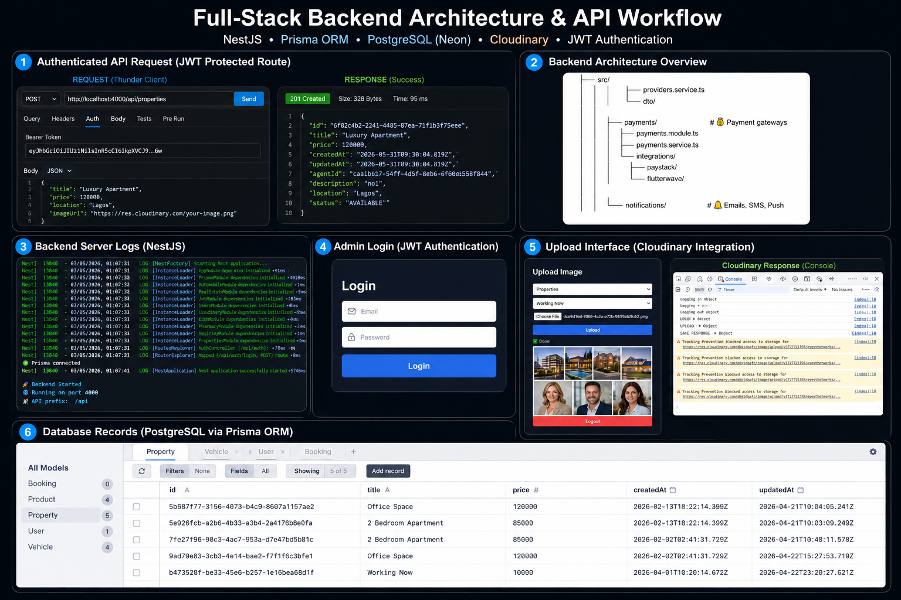

# EyesightWorks Real Estate Backend System

A scalable production-ready backend system built with NestJS, TypeScript, Prisma ORM, PostgreSQL, Cloudinary, and JWT authentication.

This project demonstrates a complete backend engineering workflow including authentication systems, protected API routes, image uploads, database persistence, admin management, and modular RESTful API architecture for scalable business applications.

---

# System Architecture



---

# Project Overview

This backend platform was designed to support scalable business management systems including:

- Real Estate Management
- Property Listing Platforms
- Booking Systems
- Product Management
- Vehicle Listings
- Pharmacy Management
- Admin Dashboard Operations

The system follows a modular backend architecture using NestJS and Prisma ORM for scalability, maintainability, clean architecture, and structured API development.

---

# Core Features

- JWT Authentication
- Role-Based Access Control (RBAC)
- Protected API Routes
- RESTful API Architecture
- PostgreSQL Database Integration
- Prisma ORM
- Cloudinary Image Upload Integration
- Admin Authentication System
- CRUD Operations
- Backend Logging
- Multi-Entity Management
- Request Validation
- Error Handling & Validation
- Secure Environment Variable Management
- Modular Scalable Architecture
- Media Upload Workflow
- Production-Ready Backend Structure

---

# Tech Stack

## Backend Framework
- NestJS
- Node.js
- TypeScript

## Database & ORM
- PostgreSQL
- Prisma ORM

## Authentication & Security
- JWT Authentication
- Role-Based Authorization

## Cloud & Media
- Cloudinary

## Deployment & Hosting
- Vercel
- Render
- Neon PostgreSQL

## Development Tools
- Thunder Client
- Git & GitHub

---

# Project Structure

```bash
src/
├── auth/
├── users/
├── properties/
├── booking/
├── pharmacy/
├── vehicles/
├── upload/
├── prisma/
├── common/
└── main.ts
